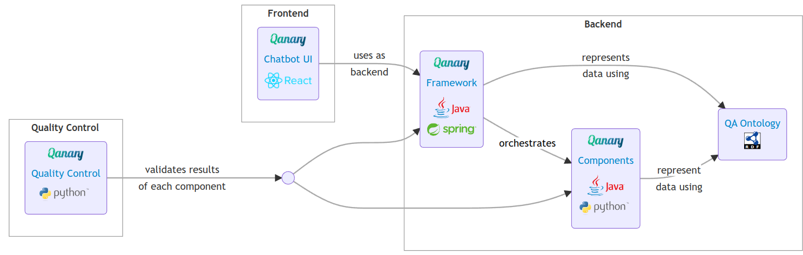

# The Qanary Ecosystem

Here, is a short description of the contributions of the [WSE group](http://wse-research.org/) to the Qanary ecosystem.
It consists of several artifacts that are used to build Knowledge Base Question Answering systems.
All are located in their own GitHub repositories.

* [Qanary](https://github.com/WDAqua/Qanary) is a framework for building Question Answering systems build on top of the [Spring Boot framework](https://projects.spring.io/spring-boot/) and using RDF annotations to represent the knowledge about a given user's question. The basic functionality of the Qanary is to provide the orchestration of Qanary components.
  * [Build and run the complete Qanary Question Answering Pipeline in a Docker container](https://github.com/WDAqua/Qanary-Pipeline-Docker).
  * Create a Java component from the [Qanary Maven Archetype](https://github.com/WDAqua/Qanary/tree/master/qanary_component-archetype).
  * Create a Python component using the [Qanary Python Helper Library](https://github.com/Perevalov/qanary_helpers).
* The [Qanary components](https://github.com/WDAqua/Qanary-question-answering-components/) implement tasks that are needed to answer questions in particular domains. Typically, each component is solving one task only (e.g., Language Detection, Named Entity Recognition, Relation Detection, Expected Answer Type Classification, Query Building, Answer Candidate Filtering).
* For establishing the data exchange between components, the [Question Answering vocabulary (short: qa)](https://github.com/WDAqua/QAOntology) is used.
* The [Qanary Chatbot UI](https://github.com/WDAqua/Qanary-Chatbot-UI) is providing an easy-to-use web-based chatbot frontend that can be connected to the Qanary framework APIs.

